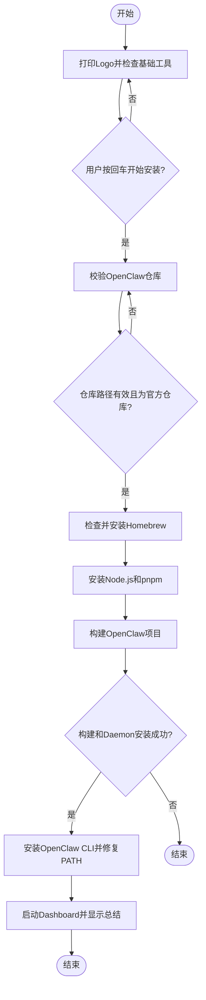

# <span id="前言">🦞[**OpenClaw**](https://github.com/openclaw/openclaw)安装脚本</span>


[toc]

## 🔥 <font id=Features>Features</font> <a href="#前言" style="font-size:17px; color:green;"><b>🔼</b></a> <a href="#🔚" style="font-size:17px; color:green;"><b>🔽</b></a>

- 交互式安装流程，支持彩色日志与步骤提示
- 强校验本地  [**OpenClaw**](https://github.com/openclaw/openclaw) 仓库目录及 **Git** 远端
- 自动检测并安装 [**Homebrew**](https://brew.sh/)
- 支持可选执行 `brew update / upgrade / cleanup`
- 使用 `brew install node` 与 `brew install pnpm`
- 已安装依赖自动跳过，避免重复升级
- 自动执行  [**OpenClaw**](https://github.com/openclaw/openclaw) 官方构建与 **daemon** 安装流程
- 全局安装 `openclaw` **CLI**
- 安装后自动检测命令可用性，必要时自动修复 **PATH**
- 自动启动 `openclaw dashboard`
- 关键步骤支持失败自动重试
- 全流程输出日志，便于排障

## 一、脚本作用 <a href="#Features" style="font-size:17px; color:green;"><b>🔼</b></a> <a href="#🔚" style="font-size:17px; color:green;"><b>🔽</b></a> <a href="#前言" style="font-size:17px; color:green;"><b>🔼</b></a>

这是一个面向 **macOS** 的 [**OpenClaw**](https://github.com/openclaw/openclaw) 一键安装脚本，目标是把本地仓库校验、依赖准备、项目构建、**CLI** 安装、**PATH** 修复和 **Dashboard** 启动串成一条完整安装链路

## 二、流程图 <a href="#Features" style="font-size:17px; color:green;"><b>🔼</b></a> <a href="#🔚" style="font-size:17px; color:green;"><b>🔽</b></a> <a href="#前言" style="font-size:17px; color:green;"><b>🔼</b></a>



## 三、核心流程 <a href="#Features" style="font-size:17px; color:green;"><b>🔼</b></a> <a href="#🔚" style="font-size:17px; color:green;"><b>🔽</b></a> <a href="#前言" style="font-size:17px; color:green;"><b>🔼</b></a>

### 1. 启动引导 <a href="#前言" style="font-size:17px; color:green;"><b>🔼</b></a> <a href="#🔚" style="font-size:17px; color:green;"><b>🔽</b></a>

- 脚本启动后先显示安装说明
- 等待用户按回车后再开始
- 全程带彩色日志和步骤提示

### 2. 仓库路径校验 <a href="#前言" style="font-size:17px; color:green;"><b>🔼</b></a> <a href="#🔚" style="font-size:17px; color:green;"><b>🔽</b></a>

- 要求用户拖入本地 `openclaw` 仓库目录
- 自动判断该目录是否为 **Git** 仓库
- 自动检查 `origin` 是否指向官方仓库`https://github.com/openclaw/openclaw`
- 路径错误时会循环提示，直到输入正确

### 3、[**Homebrew**](https://brew.sh/) 自检与处理 <a href="#前言" style="font-size:17px; color:green;"><b>🔼</b></a> <a href="#🔚" style="font-size:17px; color:green;"><b>🔽</b></a>

- 若未安装  [**Homebrew**](https://brew.sh/)，则按官方方式自动安装
- 若已安装，则提示用户是否执行整体更新
- 整体更新包含：
  - `brew update`
  - `brew upgrade`
  - `brew cleanup`
  - `brew doctor`
  - `brew -v`

### 4. 依赖安装策略 <a href="#前言" style="font-size:17px; color:green;"><b>🔼</b></a> <a href="#🔚" style="font-size:17px; color:green;"><b>🔽</b></a>

- 使用 `brew install node` 安装 **Node.js**，而不是单独安装 [**npm**](https://www.npmjs.com/)
- 使用 `brew install pnpm` 安装 [**pnpm**](https://pnpm.io/)
- 若 `node` 或 `pnpm` 已存在，则直接跳过，不重复升级。这样避免和前面的 `brew upgrade` 逻辑重复

### 5、官方构建流程 <a href="#前言" style="font-size:17px; color:green;"><b>🔼</b></a> <a href="#🔚" style="font-size:17px; color:green;"><b>🔽</b></a>

> 进入本地 [**OpenClaw**](https://github.com/openclaw/openclaw) 仓库后，依次执行：

```shell
pnpm install
pnpm ui:build
pnpm build
pnpm openclaw onboard --install-daemon
```

其中 `pnpm openclaw onboard --install-daemon` 会单独提示，因为它是最容易受系统权限影响的一步。

### 6. CLI 安装 <a href="#前言" style="font-size:17px; color:green;"><b>🔼</b></a> <a href="#🔚" style="font-size:17px; color:green;"><b>🔽</b></a>

- 使用 `npm install -g openclaw` 全局安装 [**OpenClaw**](https://github.com/openclaw/openclaw)  **CLI**

### 7. PATH 自动修复 <a href="#前言" style="font-size:17px; color:green;"><b>🔼</b></a> <a href="#🔚" style="font-size:17px; color:green;"><b>🔽</b></a>

- 安装完成后先检测 `openclaw` 命令是否可用
- 如果已经可用，则不修改 **PATH**
- 如果不可用，则自动将 [**npm**](https://www.npmjs.com/) 全局 **bin** 目录写入 shell 配置文件
- 这是兜底方案，避免用户安装完成后仍然 `command not found`

### 8. 启动 Dashboard <a href="#前言" style="font-size:17px; color:green;"><b>🔼</b></a> <a href="#🔚" style="font-size:17px; color:green;"><b>🔽</b></a>

- 最后自动执行：`openclaw dashboard`

- 若启动失败，会给出手动执行提示

<a id="🔚" href="#前言" style="font-size:17px; color:green; font-weight:bold;">我是有底线的➤点我回到首页</a>

